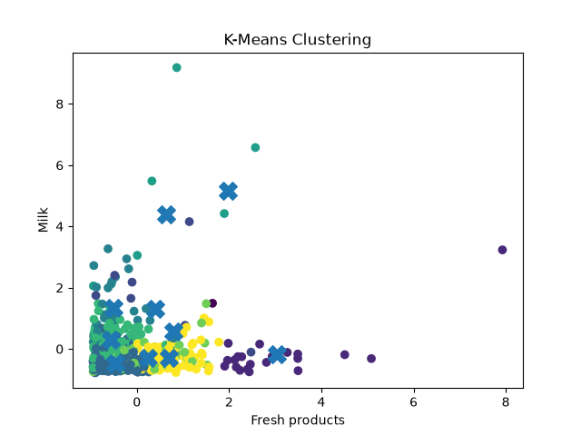
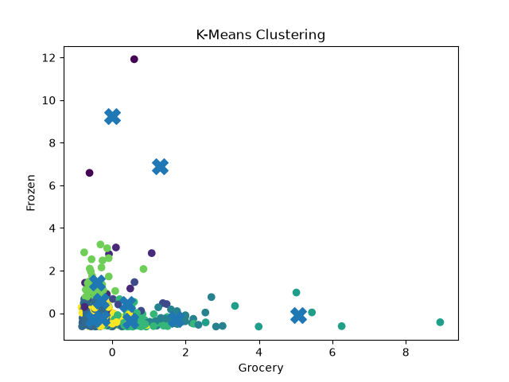
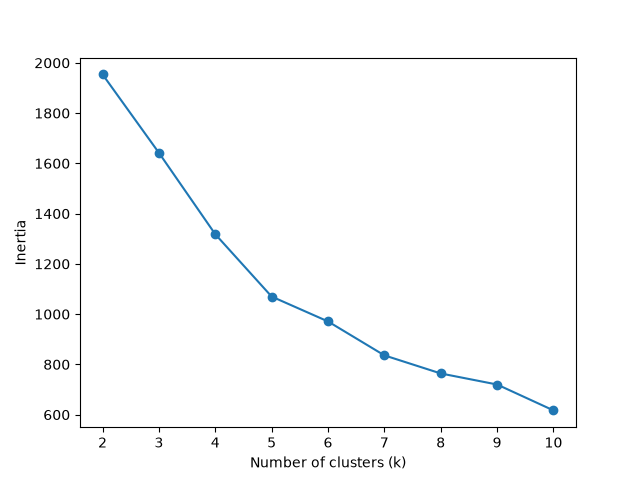
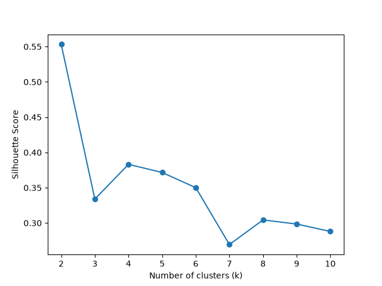

# K - Means Clustering from scratch

This project implements K - Means clustering from scratch without relying on machine learning libraries for core algorithm. The implementation validated by comparing its performing with scikit-learn's `KMeans` on the wholesale customers dataset.

## Features

* K-Means clustering implemented from scratch
* Euclidean distance
* nearest distance centroid in multiple centroids.
* assinging it's cluster to each centroid and it's points.
* calculate new centroids distances.
* k-means loop, if centrods stop changing in new centroid calculation.
* Those are final centroids.
* Evaluted model with inertias and silhouette score.
* also calinski_harabasz_score,davies_bouldin_score by scikit learn.
* Comparison with scikit-learn 
* Fresh vs milk clustering plot
* grocery vs frozen clustering plot
* inertias elbow plot
* silhouette score plot

## Dataset

**wholesale customers dataset** 

Source:

UCI Machine Learning Repository

This dataset contains numerical features of customer purchases

This dataset contains **440 samples and 8 numercal features**

## Algorithm

K-Means clustering is unsupervised machine learning algorith based on Euclidean distance.

This algorithm groups the similar samples, each cluster collects the (similar) nearest samples to it's centroid.  

### Euclidean distance

d = √((x₁ - x₂)² + (x₁ - x₂)² + ... + (xₙ - xₙ)²)

## Implementation 

* Loaded the wholesale customer dataset
* Filtered the useful features
* scaled the features
* created the initialize centroids function which will choose random sample as centroids.
* Find the euclidean distance between sample and centroid.
* created the function which finds distance between point and multiple centroids.
* after finding the nearest centroid for every point.
* assign them to clusters.
* calculated new centroids.
* created kMeans loop, if new centroids matched with previous centroids, the loop will stop by considering them as final centroids.
* find inertias for every k size.
* k = number of clusters we choose.
* evaluated the model with elbow method, by choosing different ks.
* Use silhoueted score to evaluated.
* Compared with scikit learn implemention, metrics.
* use calinski_harabasz_score, davies_bouldin_score to evaluate the scikit learn model.

## Results 

### From Scratch

```text id="t6p8ra"
k: 6 inertia: 970.5087619639767
best inertia between 6 to 10

Silhouette Score: 0.5878146460367379
```
### scikit learn
```text id="t6p8ra"
k: 6 inertia: 971.2028218633683
best inertia between 6 to 10

Best k by Silhouette: 2 0.5532526964184259
Best k by Calinski-Harabasz: 5 159.45185379722992
Best k by Davies-Bouldin: 10 0.9324223409287795
```
The from-scratch implementation was compared with scikit-learn's `KMeans` using the same dataset and train-test split.

## Visualizations

### K means clustering 





### Elbow method



### Silhouette Score



## Folder Structure

```text id="p3k7vz"
K-Means clustering/
│
├── plots/
│   ├── fresh_vs_milk.png
|   ├── grocery_vs_frozen.png
|   ├── elbow.png
|   ├── silhouette_score.png
│
├── wholesale_data.csv
├── from_scratch.py
├── sklearn_model.py
├── visualization.py
└── README.md
```

## what I learned

* Implemented k means clustering from scratch.
* Learned how euclidean used for k means clustering.
* Learned how k means find distances from multiple centroids to one point.
* Learned how to implement for multiple clusters and they're centroids, points.
* Learned how to evaluate the k means algorithm.
* Learned the difference between every evaluation function.
* Learned how silhouette score evalute the model.
* Learned how clcalinski_harabasz_score, davies_bouldin_score evaluated the model.
* Learned one evaluation function, cannot estimate the whole performance of the models.
* Learned each evaluation function have different thing to tell about model performance.
* observed how k's change the inertias and evaluation scores in plots.


